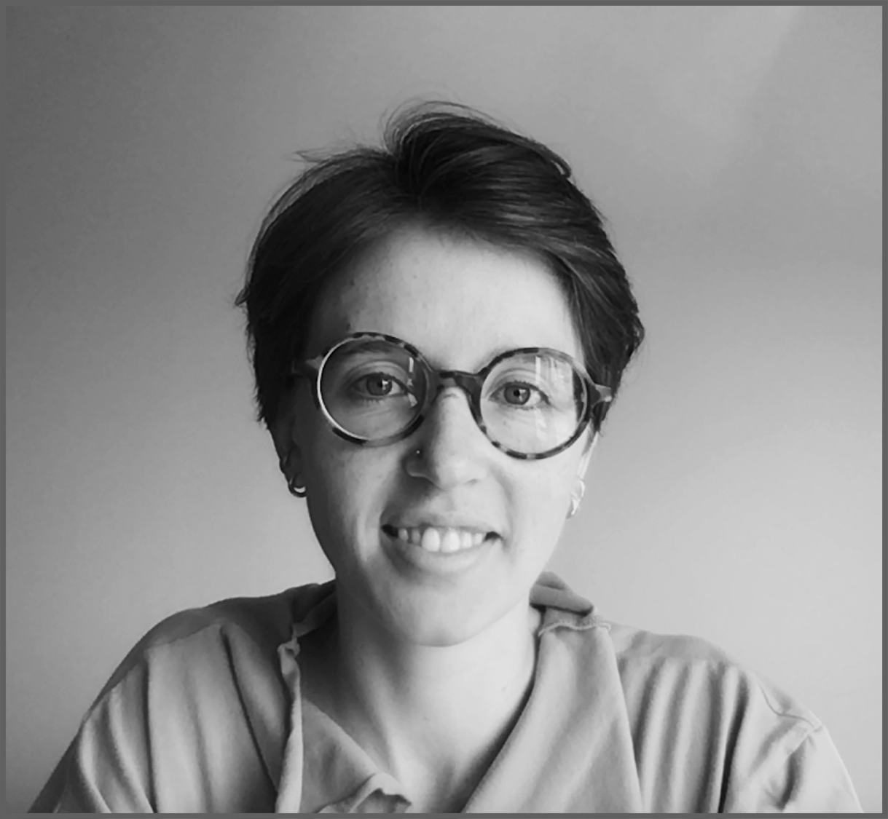

  

    

      

    

  

  

    

      
I'm a <b>Ph.D. candidate in astronomy</b> at the University of Victoria (BC, Canada) working with <a href="https://www.astro.uvic.ca/~rbdong/astro/Welcome.html" target="_blank">Dr. Ruobing Dong</a>. My research is focused on understanding how exoplanets form, and how we can detect them while they are still being born. I work with observations from the <a href="https://www.almaobservatory.org/en/about-alma/" target="_blank">ALMA radio telescope</a>, and I often perform computational simulations to help interpret the observations. A complete list of research projects can be found <a href="research/">here</a>, and a complete list of my papers can be found in my <a href="https://ui.adsabs.harvard.edu/public-libraries/OOULjEiIR02eZGFIpVmyLQ" target="_blank">ADS Library</a> or through <a href="https://orcid.org/0000-0003-3430-3889" target="_blank">ORCID</a>. My research is funded by the <a href="https://www.nserc-crsng.gc.ca/index_eng.asp" target="_blank">Natural Sciences and Engineering Research Council of Canada</a>. 

      
Before arriving at UVic, I did my B.Sc. at McMaster University (Hamilton, ON) in the interdisciplinary research-based <a href="https://sis.mcmaster.ca/undergraduate/isci/" target="_blank">Integrated Science Program</a>, with a concentration in astrophysics. During my four years at McMaster, I worked with <a href="https://www.lcpastro.com/" target="_blank">Dr. Laura Parker</a>, <a href="https://experts.mcmaster.ca/display/wilsoncd" target="_blank">Dr. Christine Wilson</a>, and in particular <a href="https://physwww.mcmaster.ca/people/faculty/Pudritz_RE_h.html" target="_blank">Dr. Ralph Pudritz</a>, who supervised my honours thesis. During the summers, I worked on projects with <a href="https://www.exoplanetes.umontreal.ca/our-team/professors/david-lafreniere-2/?lang=en" target="_blank">Dr. David Lafrenière</a> at the Institute for Research on Exoplanets (Montréal, QC), and <a href="https://www.jjzanazzi.com/home" target="_blank">Dr. J.J. Zanazzi</a> at the Canadian Institute for Theoretical Astrophysics (Toronto, ON).

    

  

