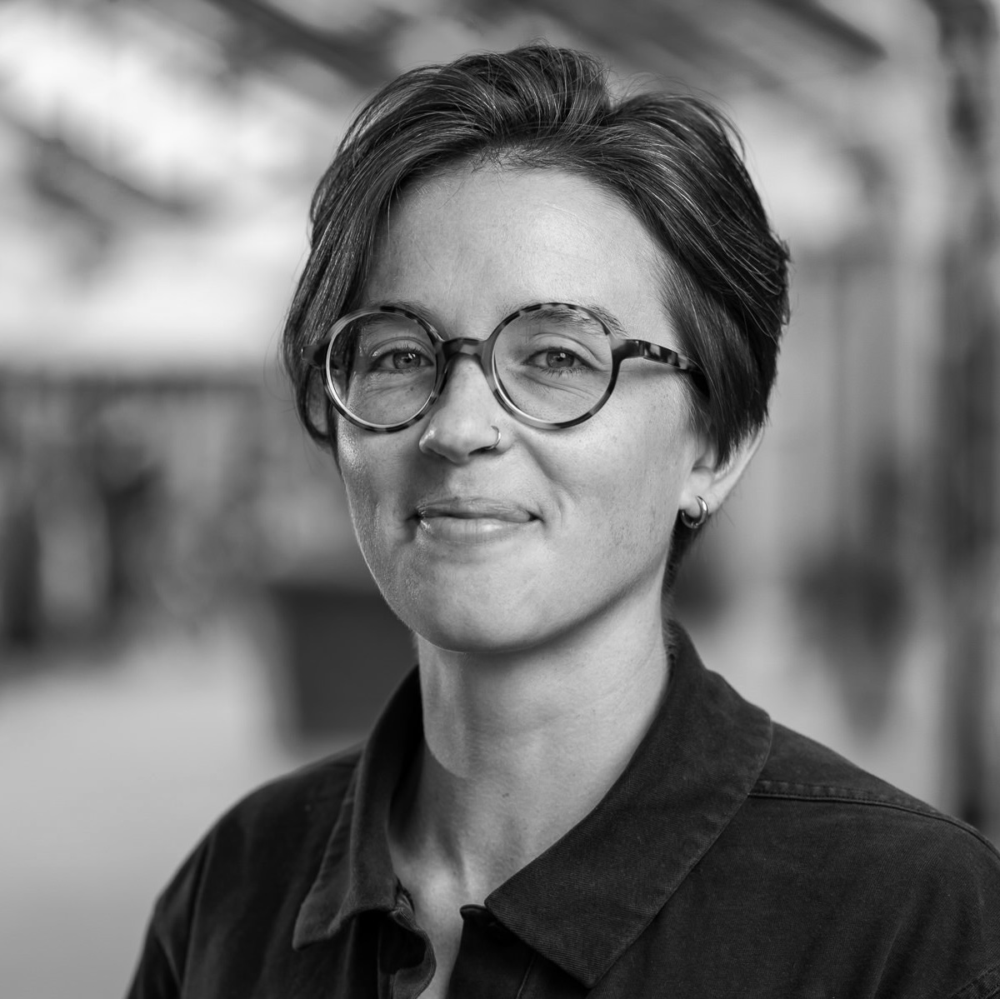

  

    

      

    

  

  

    

      
I am a <a href="https://www.hsfoundation.org/news-stories/eight-post-doctoral-scientists-awarded-51-pegasi-b-fellowship/" target="_blank">51 Pegasi b Fellow</a> at the Massachusetts Institute of Technology (MIT), working with the <a href="https://pfl.mit.edu/" target="_blank">Planet Formation Lab</a> led by Richard Teague in the <a href="https://eaps.mit.edu/news-impact/mit-welcomes-2025-heising-simons-foundation-51-pegasi-b-fellow-jess-speedie/" target="_blank">Department of Earth, Atmospheric & Planetary Sciences</a> (EAPS). I'm also engaged in the MIT School of Science Fellows community as an inaugural cohort member.

      
My research is focused on how planetary systems arise around young stars. 
      The big-picture motives are to find young planets, characterize their birth environments, and understand the physical processes at play. 
      <!-- This work is central to understanding the history of mature planetary systems like our own Solar System.  -->
      I work primarily with observations from the <a href="https://www.almaobservatory.org/en/about-alma/" target="_blank">ALMA radio telescope</a>, and I often perform computational simulations to help interpret the data. 
      <!-- understanding how exoplanets form, and how we can detect them while they are still being born.  -->
      A complete list of research projects can be found <a href="research/">here</a>, and a complete list of my papers can be found in my <a href="https://ui.adsabs.harvard.edu/public-libraries/OOULjEiIR02eZGFIpVmyLQ" target="_blank">ADS Library</a> or through <a href="https://orcid.org/0000-0003-3430-3889" target="_blank">ORCID</a>.

      
Before arriving at MIT, I completed my Ph.D. in astronomy at the <a href="https://www.uvic.ca/science/physics/index.php" target="_blank">University of Victoria</a> working with <a href="https://www.ruobingdong.com/" target="_blank">Ruobing Dong</a>. 
      I did my B.Sc. at <a href="https://physics.mcmaster.ca/" target="_blank">McMaster University</a> in the interdisciplinary research-based <a href="https://sis.mcmaster.ca/undergraduate/isci/" target="_blank">Integrated Science Program</a>, with a concentration in astrophysics. During my four years at McMaster, I worked with <a href="https://www.lcpastro.com/" target="_blank">Laura Parker</a>, <a href="https://experts.mcmaster.ca/display/wilsoncd" target="_blank">Christine Wilson</a>, and in particular <a href="https://physwww.mcmaster.ca/people/faculty/Pudritz_RE_h.html" target="_blank">Ralph Pudritz</a>, who supervised my honours thesis. During the summers, I worked with <a href="https://www.exoplanetes.umontreal.ca/our-team/professors/david-lafreniere-2/?lang=en" target="_blank">David Lafrenière</a> at the <a href="https://exoplanetes.umontreal.ca/en/" target="_blank">Trottier Institute for Research on Exoplanets</a> (IREx), and <a href="https://www.jjzanazzi.com/home" target="_blank">J.J. Zanazzi</a> at the <a href="https://www.cita.utoronto.ca/" target="_blank">Canadian Institute for Theoretical Astrophysics</a> (CITA).

    

  

